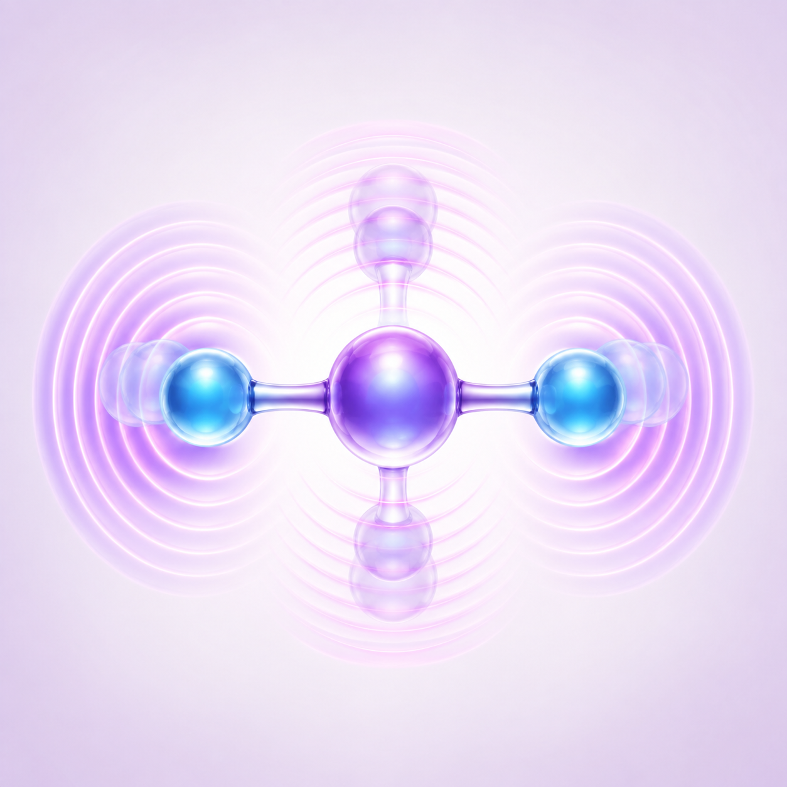

# TANG 分子科学计算平台

一个界面，连接 Windows 与科学计算环境。

TANG(唐)在 Windows 中准备计算任务，由便携式 WSL 后端自动选择电子结构或分子动力学计算引擎，并将计算结果返回 Windows。

```{image} _static/hero-science.svg
:alt: TANG(唐)分子科学计算平台示意图，包含电子轨道、原子核振动和分子动力学元素
:class: tang-hero-image
:align: center
```

## 计算模块

<div class="module-grid">
  <a class="module-card blue" href="modules/electronic-structure.html">
    
    <strong>JiFT-CHEM</strong>
    <span>量子化学计算</span>
	<span>多酸及分子筛合成</span>
	<span>光化学</span>
    <small>Support · 曲泽星 · 苏忠民 · 徐昕</small>
  </a>
  <a class="module-card violet" href="modules/nuclear-motion.html">
    
    <strong>JLN-CHEM</strong>
    <span>超精细光谱</span>
    <small>Support · 李辉</small>
  </a>
  <a class="module-card green" href="modules/molecular-dynamics.html">
    
    <strong>PYGAMD</strong>
    <span>分子动力学模拟</span>
    <small>Support · 朱有亮 · 吕中元</small>
  </a>
</div>

## 从这里开始

- 第一次使用请先阅读[安装指南](guide/installation.md)。
- 已经安装完成，可以直接查看[快速开始](guide/quick-start.md)。
- 遇到问题时，请查看[故障排查](reference/troubleshooting.md)。

```{toctree}
:hidden:
:maxdepth: 2
:caption: 开始使用

guide/introduction
guide/installation
guide/quick-start
```

```{toctree}
:hidden:
:maxdepth: 2
:caption: 计算模块

modules/electronic-structure
modules/nuclear-motion
modules/molecular-dynamics
```

```{toctree}
:hidden:
:maxdepth: 2
:caption: 系统与维护

reference/architecture
reference/task-routing
reference/troubleshooting
reference/build-and-release
```

```{toctree}
:hidden:
:maxdepth: 1
:caption: 关于

about/support
about/cite
about/license
```
